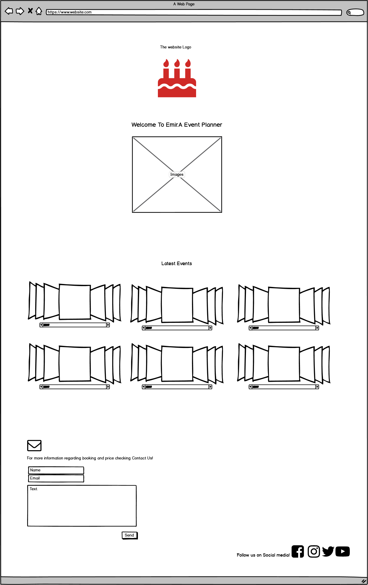
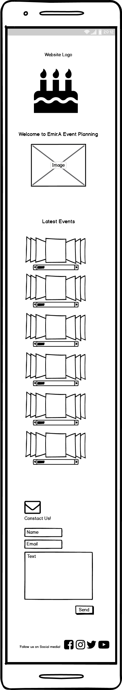

# MilestoneProject-1
---
## User Stories:

### **1.** As a User
- I want to book an event planner, 
so that i can discuss the details of an event that i want to plan.

### **2.** As a User
- I want to see what kind of event have been done, 
so that i can see if this event planner is the right one for my event.

### **3.** As a User
- I want to contact the event planner, 
to check what date they are available to be booked and price checking.

### **4.** As a user
- I want to show the pictures in this website, 
to show my relatives what this event planner is capable of.

---

# HEADER:
## Features

### The pictures are categorised
### **1.** Each picture category has a slide that show the other pictures in the same category
### **2.** User can see what kind of event have been done 
### **3.** User can contact the event planner
### **4.** User can check prices by contacting through email
### **5.** User can see many different picutres of previous events

- ## To be implemented Features
- #### Event callender where the user can see the available date to be booked
- #### The callender will show uppcoming event's in date and time
- #### An `icon` that will reffer to partners of this website
- #### A new tab that will tell `About Us` page 
---
# FOOTER
## Social Media:

| Facebook | Instagram |Twitter | Youtube | 
| --- | --- | --- |  --- | 
---
# Event's:
### **1.**  The user can see a variaty of different event's that have been done
### **2.**  The user can compare the pictures of even't with other even planners
### **3.**  The important of the pictures gives the user an overal idea of what can be done.
---
# ONTACT US: 
 - ### Html form with fields `name` and `email` allowing a client to book the planner.
 - ### In the Html form there is a `text` box where the User can write to the planner.
 ---
 
 ### Wireframe Features
 ### **1.** The Event Planner logo
 ### **2.** Welcoming the User to this website: `Welcome  to Emire.A Event Planner`
 ### **3.** An image under the welcoming text
 ### **4.** Text that say `Latest Events`
 ### **5.** Six picture categories that have slides showing more pictures on each categori
 ### **6.** A contact us form where the user writes their `name` and `email`and a `text`
 ### **7.** A text that says: `Follow us on social media!`
 ### **8.** Social media icons of `Facebook`, `Instagram`, `Twitter`, `Youtube`  
 
 
 ### Wireframe Desktop 
 
 
 ---
 
 ### Wireframe Mobile
 
 
 
